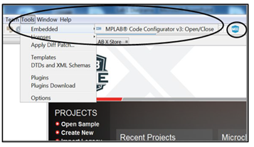
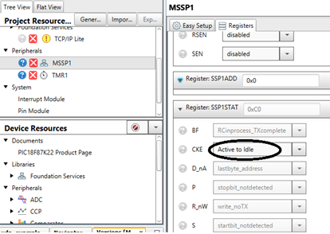
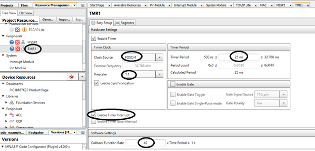
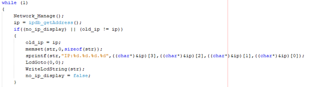
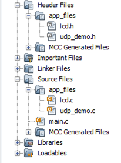

<!-- Please do not change this html logo with link -->

# TCP/IP Lite Stack + ENC24J600 Examples

This repository provides MPLAB X IDE projects that can work out of the box. The code examples that are included in the repository include functionality for DHCP, UDP, TCP Server and TCP Client Demos. If the user wants to create the project from scratch, please use the below instructions to get started. The app_files folder may be copied into the project to build the projects. Note that the TCP/IP Lite stack needs to be serviced every 1 second and the timer callback function needs to be set to 1 second.

---

## Related Documentation

More details can be found at the following links:
- [Microchip Ethernet Controllers](https://www.microchip.com/design-centers/ethernet/ethernet-devices/products/ethernet-controllers)
- [ENCx24J600](https://www.microchip.com/wwwproducts/en/en541877)
- [Ethernet PICtail Plus Daughter Board](https://www.microchip.com/DevelopmentTools/ProductDetails/PartNO/AC164132)
- [TCP/IP Lite Stack](https://www.microchip.com/wwwAppNotes/AppNotes.aspx?appnote=en573940)
- [Explorer 8 Development Board](https://www.microchip.com/promo/explorer-8-development-board)

## Software Used

- MPLAB® X IDE 5.40 or newer [(microchip.com/mplab/mplab-x-ide)](http://www.microchip.com/mplab/mplab-x-ide)
- MPLAB® XC8 2.20 or a newer compiler [(microchip.com/mplab/compilers)](http://www.microchip.com/mplab/compilers)
- MPLAB® Code Configurator (MCC) 4.0.1 or newer [(microchip.com/mplab/mplab-code-configurator)](https://www.microchip.com/mplab/mplab-code-configurator)
- MPLAB® Code Configurator (MCC) Device Libraries PIC10 / PIC12 / PIC16 / PIC18 MCUs [(pic10-pic12-pic16-pic18-1.81.6.mc3lib)](http://ww1.microchip.com/downloads/en/DeviceDoc/pic10-pic12-pic16-pic18-1.81.6.mc3lib)
- MPLAB® Code Configurator (MCC) Application Libraries TCP/IP Lite Stack [(tcpipLiteStack-2.2.13.mc3lib)](http://ww1.microchip.com/downloads/en/DeviceDoc/tcpipLiteStack-2.2.13.mc3lib)

## Hardware Used

- Explorer 8 Development Kit [(DM160228)](https://www.microchip.com/Developmenttools/ProductDetails/DM160228)
- Fast 100Mbps Ethernet PICtail Plus Daughter Board [(AC164132)](https://www.microchip.com/DevelopmentTools/ProductDetails/PartNO/AC164132)
- [PIC18F87K22](https://www.microchip.com/wwwproducts/en/PIC18F87K22)

## Setup

To install the MPLAB® Code Configurator Plugin:
1. In MPLAB X IDE, select Plugins from the Tools menu.
2. Select the Available Plugins tab.
3. Check the box for the MPLAB® Code Configurator v3, and click on Install.

---

To install the TCP/IP Lite Stack Library:
1. Open the MPLAB Code Configurator page: [https://www.microchip.com/mcc](https://www.microchip.com/mplab/mplab-code-configurator)
2. Scroll to the bottom of the page and select the Current Downloads tabs.
3. Download the TCP/IP Lite Stack Application Library [(tcpipLiteStack-2.2.13.mc3lib)](http://ww1.microchip.com/downloads/en/DeviceDoc/tcpipLiteStack-2.2.13.mc3lib).
4. In the MPLAB® X IDE click on Tools → Options.
     - This may also be found under: In the MPLAB® X IDE click on MPLAB® X IDE → Preferences.
5. Click on Plugins tab.
6. Click on Install Library.
7. Browse to the location where you saved tcpipLiteStack-2.2.13.mc3lib, select and click Open.

---

## DHCP Example

1. Open the MPLAB X IDE v5.40.
 
2. Create a new standalone project. This project uses the device PIC18F87K22 and XC8 compiler (v2.20).
3. Launch the MCC plugin using the MCC icon in the top right corner in MPLAB X IDE. Alternatively, MCC can also be launched by selecting Tools-> Embedded-> MPLAB Code Configurator v3: Open/ Close.
 
4. In Project Resources tab, select System Module. 
    - Go to Registers view, in RSTOSC, choose “HFINTOSC with HFFRQ = 64 MHz and CDIV = 1:1” from the dropdown menu.
 
5.	Expand Ethernet tab in Project Resources. Click on MAC in the Project Resources tab. This will give a list of available Media Access Controllers in the MPLAB Code Configurator tab. Select ENCx24J600.
 
6.	In Project Resources, click on the System Module. In Easy Setup tab, make the Oscillator Select to choose Internal RC Oscillator, CLKOUT function on OSC2.
 
 
Navigate to the Registers tab in the MPLAB Code Configurator window. In the CONFIG1L register, disable the XINST bit to disable the extended instruction set.
 
7. Master Synchronous Serial Port module (MSSP 1) needs to be configured as SPI Master for accessing the ENCx24J600 MAC. Configure the MSSP1 in the Easy Set-up as follows:
    - Serial Protocol: SPI
    - Mode: Master
    - Input data sampled at: End
    - Clock source: FOSC/4
 
8. Configure the MSSP1 in the Registers tab as follows:
    - CKE: Active to Idle
 
 
Keep rest of the settings same as default.
9.	Timer 1 needs to be configured to generate an interrupt every 1 s to serve as RTCC for the TCP/IP Lite Stack. Configure TMR1 in Easy Setup as shown in figure as follows:
    - Check Enable Timer
    - Prescaler: 1:1
    - Timer Period = 25 ms
    - Check Enable Timer Interrupt
    - Callback function rate = 40 (to generate 1s period)
 
10. Go to the Pin Manager: Grid MCC tab. Click on the following pins for their configuration
 
 
11.	Go to Pin Module under Project Resources. Set the custom names for the pins as shown in the table in the MPLAB Code Configurator tab.
 
12.	Click on Generate to generate the code for configured modules.
 
Note: Click on Generate even if MPLAB X shows a warning. These warnings are handled later by modifying the code. Close the Merge MCC tab which automatically opens on clicking Generate. Click on Yes if MPLAB X asks a Question to close the Merge MCC tab.
 
13. In main.c, enable global and peripheral interrupts.
 
 
14.	In the generated code, in main.c add Network_Manage() in the while(1) loop. This is required to handle the packets in the network.
 
15.	Click Clean and Build Project. After successful build, click on Program Device to program the code to the device.
16.	Launch Wireshark. From the Capture menu, click Options.
Select an Interface from the list to which your board and PC are connected, click Start for capturing packets.
 
    - e.g.: Local Area Network
 
17.	In Wireshark, set the filter field as bootp.
 
18.	Adding the LCD code:
    - Right click on Header files and create a new logical folder under Header Files named as app_files.
 
    - Right click on the app_files folder and Add Existing Item. Select lcd.h.
 
    - Similarly create a new folder under Source Files named app_files. Add lcd.c file in that folder.
 
    - In main.c, add the following code:
        - Add the header include for lcd.h: 
         #include "app_files/lcd.h"
        - Add the header include for getting IP address:
         #include "mcc_generated_files/TCPIPLibrary/ip_database.h"
        - Add the header include for using memset function:
         #include <string.h>
        - Add before SYSTEM_Initialize():
         unsigned long ip, old_ip;
         char str[32];
         bool no_ip_display = true;
        - After SYSTEM_Initialize():
         LcdInitialization();
        - Add inside while(1) loop:
         
19.	Click Clean and Build Project. After successful build, click on Program Device to program the code to the device.
20.	Check the IP address of the Explorer 8 Development Board which is displayed on the LCD. Note it down.
21.	In the Command Prompt ping the Explorer 8 Development board using its IP address with the command:
 ping IP Address
 e.g.: ping 192.168.0.46
 

---

## UDP Example

1.	Follow all steps from DHCP Example.
2.	Under Header Files/app_files, right click and Add Existing Item. Select udp_demo.h.
3.	Under Source Files/app_files, right click and Add Existing Item. Select udp_demo.c.
 
4.	Open Windows Command Prompt application on your PC. Type “ipconfig” to get the IP address of your PC.
 
5.	In main.c, add the following code:
    - Add the header include for udp_demo: 
     #include "app_files/udp_demo.h"
    - Add inside the while(1) loop add code for UDP Send function:
     
6.	Sending UDP Packets: In udp_demo.c, under the function DEMO_UDP_Send():
    - Modify the Destination IP address with your PC’s IP address as noted in Step 4.
    - Destination Port (anything in the range of dynamic ports)
     
7.	Receiving UDP Packets: In Source Files\MCC generated files\ udpv4_port_handler_table.c, add the following code:
    - In the header include the udp demo file:
     #include "../../app_files/udp_demo.h"
    - In UDP_CallBackTable, add the following code to perform UDP Receive:
     
8.	Click Clean and Build Project. After successful build, click on Program Device to program the code to the device.
9.	Open the Java application TCPIP_Demo.exe. Go to the UDP tab and assign the same port number as ‘DestPort’(65531). Click on ‘Listen’ button. Click “Allow Access” if warning occurs. Assign the IP Address of your board which is displayed on the LCD(192.168.0.46). Click on ‘Claim’ button.
 
10.	Launch Wireshark. From the Capture menu, click Options.
Select an Interface from the list to which your board and PC are connected, click Start for capturing packets.
 
e.g.: Local Area Network
 
11.	In Wireshark, set the filter field as bootp||udp.port==65531.
12.	In Demo GUI, click on LED 1, 2, 3, 4 to light the LEDs D1, D2, D3, D4, respectively and observe the Wireshark capture. 
 
13.	In Demo GUI, type data(e.g.: “Microchip PIC18F87K22”) inside Send Data box and press the Send button and observe the Wireshark capture.
 
14.	On the Explorer 8 Board, press the Switch S1 and observe the Wireshark capture. 
 

---

## TCP Client Example

1.	Follow all steps from DHCP Example.
2.	Select TCP/IP Lite from project resources and check the TCP box as shown below:
 
3.	Under Header Files/app_files, right click and Add Existing Item. Select tcp_client_demo.h.
4.	Under Source Files/app_files, right click and Add Existing Item. Select tcp_client_demo.c.
 
5.	In main.c, add the following code:
    - Do TCP_Initialize() before the while(1) loop.
    - Add the header include for tcp_client_demo: 
     #include "app_files/tcp_client_demo.h"
    - Add inside the while(1) loop add code for TCP Client function:
 
    - Modify the server IP address with PC's IP address.
 
6.	Click Clean and Build Project. After successful build, click on Program Device to program the code to the device.
7.	Open the Java application TCPIP_Demo.exe. Go to the TCP Server Demo tab and assign the port number as ‘65534’. Click on ‘Listen’ button. The status of the TCP Connection is printed inside the STATUS text box.
 
 Also you can observe the same on Wireshark with filter as “bootp||tcp.port==65534”.
 
8.	After the connection is established:
    - Type text inside the Send text box and click on ‘Send’ button. The text sent is displayed inside the Sent/Received Data box and in the Wireshark window.
     
     
    - Click on the Led buttons {0, 1, 2, 3, 4}. This will toggle LEDs on board.
     
     
9.	Push ‘Disconnect’ button, to close the TCP Connection. A client disconnected message will appear on the STATUS text box.  

---

## TCP Server Example

1.	Follow all steps from DHCP Example.
2.	Select TCP/IP Lite from project resources and check the TCP box as shown below:
 
3.	Under Header Files/app_files, right click and Add Existing Item. Select tcp_server_demo.h.
4.	Under Source Files/app_files, right click and Add Existing Item. Select tcp_server_demo.c.
 
5.	In main.c, add the following code:
    - Add the header include for tcp_server_demo: 
     #include "app_files/tcp_server_demo.h"
    - Add inside the while(1) loop add code for TCP Server function:
     
6.	Click Clean and Build Project. After successful build, click on Program Device to program the code to the device.
7.	Open the Java application TCPIP_Demo.exe. Go to the TCP Client Demo tab, observe the IP address of your board i.e., on the LCD and assign it as Server IP address in the GUI. Assign the port number as ‘7’. Click on ‘Connect’ button. The status of the TCP Connection is printed inside the STATUS text box.
 
8.	After the connection is established:
    - Type text inside the Send text box and click on ‘Send’ button. The text sent is echoed and displayed inside the Sent/Received Data box.
     
    - Also in Wireshark, you can observe the TCP packets by setting the filter “tcp.port == 7” 
     
9.	Push ‘Disconnect’ button, to close the TCP Connection. TCP server closing the connection message will appear on the STATUS text box.

---